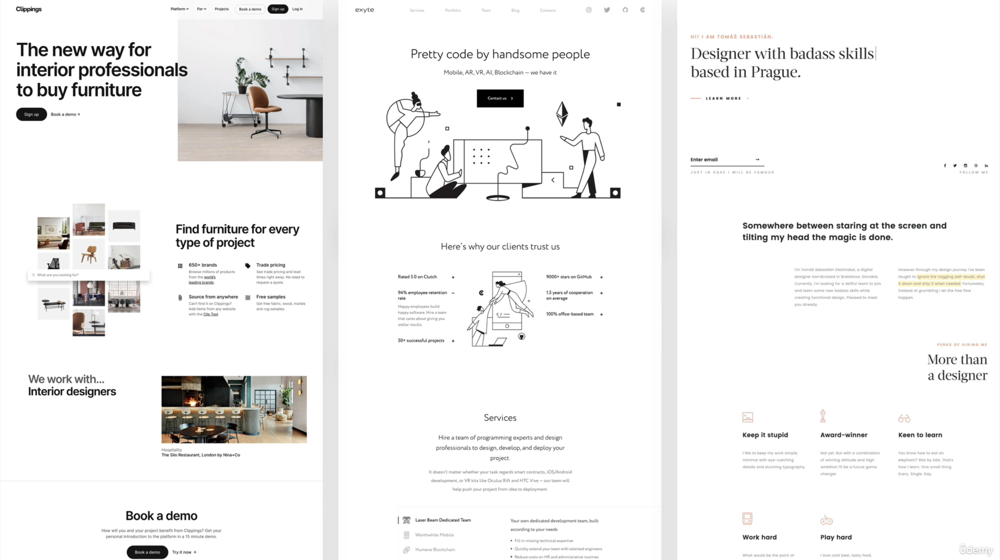
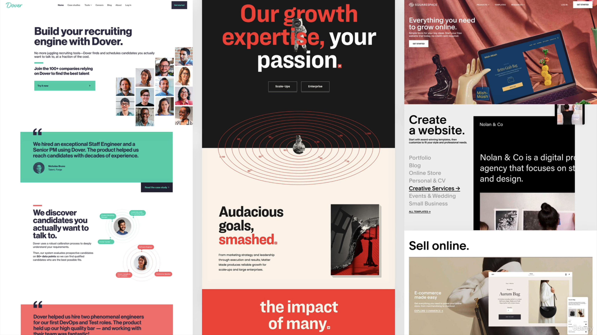
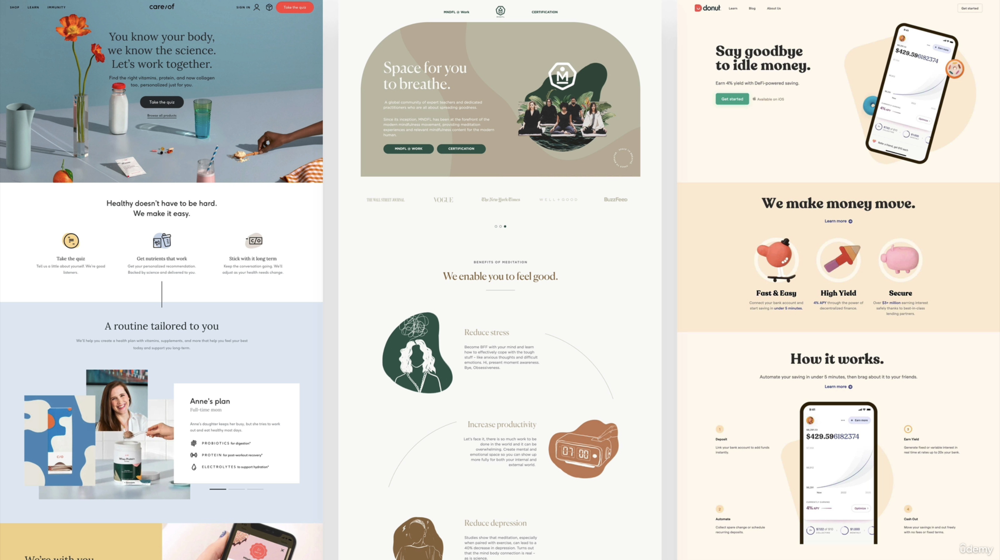
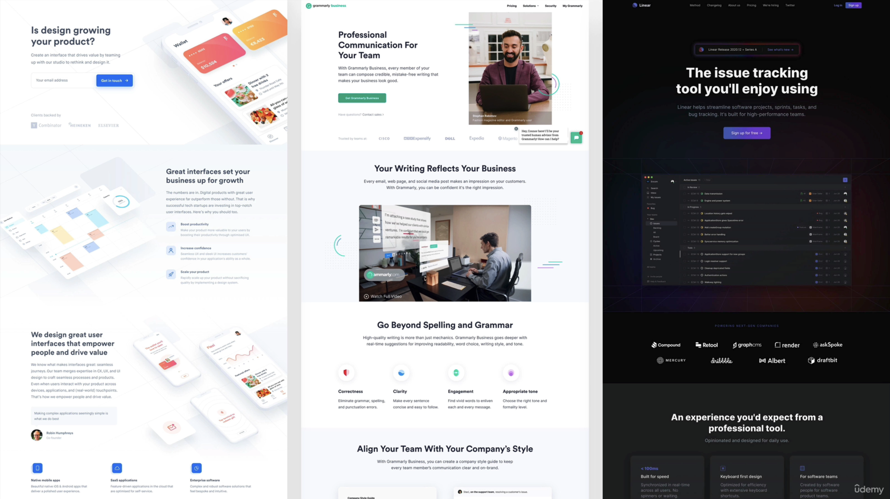

# Web-Design-Guide

A good designer: 
-  Creates an immediate and lasting impression of the product.
- Ensures the user's perceived value of the brand or prodcut.
- Gives the user exactly what they were looking for.

## Things to pay attention to in a design

- Typography
- Colors
- Images / Illustrations
- Icons
- Shadoes
- Border-radius
- Whitespace
- Visual Hierarchy
- User Experience
- Components / Layouts

## Website Personalities

- Serious / Elegant - For luxury and elegance - Thin serif typefaces - Golden or pastel colors - Big and high quality images.
   
   
  

- Minimalist / Simple - Focusses on the essential text content - Small or medium-sized sans-serif - black text and lines - Few images and icons.
   
   
  

- Plain / Neutral - Design that gets out of the way - Neutral and small typefaces - Very structured layout. - Common in big corporations.
   
   
  

- Bold / Confident - Makes an impact - Big and bold typography - Confident use of big and bright colored blocks.
   
   
  

- Calm / Peaceful - For products and services that care - soft serif headings - calming pastel colors - matching images/illustrations
   
   
  

- Startup / Upbeat - Widely used in startups - Medium sized serif typefaces - light-grey text and backgrounds - rounded elements.
   
   
  

- Playfun / Fun - Colorful and round designs - Creative elements like hand-drawn icons, illustrations, animations, and fun language.
   
   
  

## Typefaces

Serif vs Sans-serif

Serif

- Traditional / classif look and feel
- Conveys trustworthiness
- Good for long text

Sans-serif

- Modern look and feel
- Clean and simple
- Easier for beginner designer

 

Use good font sizes and weights

- Use up to 2 typefaces on each page.
- Use 16px to 32px for normal text
- For long text use a size of 20px or more
- For headlines you can use really big sizes like 50px+ and 600+ weight depending on personality
- Don't use a weight under 400
- Use less than 75 characters per line
- For normal text use a line height between 1.5 and 2 for big texts go below 1.5
- Decrease letter spacing in headlines if it seems unnatural
- Experiment with all caps for short titles. Make them small, bold, with increased letter spacing.
- Usually don't justify text
- Don't center long text blocks. Small blocks are okay.

 

Type-scale.com

A website that helps you to

## Choose the right color

- Red: Power, passion, excitment. Draws attention.
- Orange: Happy, cheerfulness, creativity. Less aggressive.
- Yellow: Joy, brightness, intelligence.
- Green: Harmony, nature, growth, health.
- Blue: Peace, trustworthiness, professionalism.
- Purple: Wealth, wisdom, magic.
- Pink: romance, care, affection.
- Brown: nature, durability, comfort.
- Black: power, elegance, minimalizm, grief and sorrow.

 

Use the main color to draw attention to the most important elements on the page.
Use colors stratigically in images and illustrations.

Text usually should not be completely black. Lighten it up it looks heavy and uninviting.
Don't use very light texts that are hard to read.

# https://heroicons.com/

Beautiful hand-crafted SVG icons, by the makers of Tailwind CSS.

# Website Personalities

   

## Serious / Elegant

 

## Minimalist / Simple

 

## Plain / Neutral

 

## Bold / Confident

 

## Calm / Peaceful

 

## Startup / Upbeat

 

## Playful / Fun

## Sources 

- [Learn modern HTML5, CSS3 and web design](https://www.udemy.com/course/design-and-develop-a-killer-website-with-html5-and-css3) by Jonas Schmedtmann

- [Open color](https://yeun.github.io/open-color/ingredients.html)
